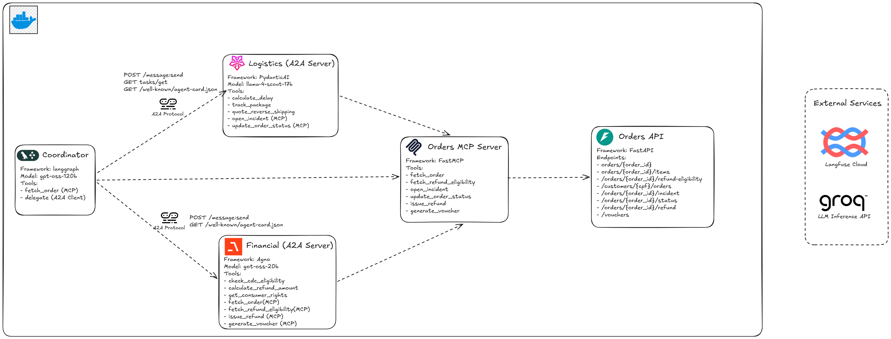

# PostVenda AI — Multi-Agent After-Sales Orchestrator

A multi-agent system for Brazilian e-commerce after-sales support, built with the **A2A protocol** (Agent-to-Agent) and a **central MCP server** that provides unified access to order data. Three specialized agents collaborate to solve logistics issues, refunds, and consumer-rights questions — orchestrated by a LangGraph coordinator with a real-time chat interface.

## Architecture



```
Browser → http://localhost:3000          (agent-chat-ui — Next.js)
            │  LangGraph SDK (SSE streaming)
            ▼
         http://localhost:2024           (Coordinator — LangGraph)
            │                                          ▲
            │  A2A JSON-RPC ──→ http://logistics:8001  (PydanticAI)
            │  A2A REST     ──→ http://financial:8002  (Agno AgentOS)
            │                                          │
            └────────── MCP (Streamable HTTP) ─────────┤
                                ▼                      ▼
                        http://orders-mcp:8004         │
                                │                      │
                                └──→ http://mock-api:8003 (FastAPI)
```

| Service | Framework | Model (via Groq) | Port |
|---|---|---|---|
| **Coordinator** | LangGraph (ReAct + create_agent) | `openai/gpt-oss-120b` | 2024 |
| **Logistics Agent** | PydanticAI (FastA2A) | `llama-4-scout-17b-16e-instruct` | 8001 |
| **Financial Agent** | Agno (AgentOS + A2A) | `openai/gpt-oss-20b` | 8002 |
| **Orders MCP** | FastMCP (Streamable HTTP) | — | 8004 |
| **Mock API** | FastAPI | — | 8003 |
| **Frontend** | `langchain-ai/agent-chat-ui` (Next.js) | — | 3000 |

### Why a Central MCP?

All order read/write operations live in a **single MCP server** (`orders-mcp`). Each agent accesses only the tools relevant to its domain, using the **native MCP adapter** of its framework:

| Agent | Adapter | Exposed MCP Tools |
|---|---|---|
| Coordinator | `langchain-mcp-adapters` (`MultiServerMCPClient`) | `fetch_order` |
| Logistics | `pydantic_ai.mcp.MCPServerStreamableHTTP` + `FilteredToolset` | `open_incident`, `update_order_status` |
| Financial | `agno.tools.mcp.MCPTools` | `fetch_order`, `fetch_refund_eligibility`, `issue_refund`, `generate_voucher` |

This removes duplicated `httpx` code, centralizes authentication/observability at the data access point, and lets new agents consume the same tool catalog without reimplementation.

## Quick Start

### 1. Prerequisites

- Docker + Docker Compose
- Free API key from [Groq](https://console.groq.com)
- (optional) [Langfuse](https://cloud.langfuse.com) keys for observability

### 2. Configure

```bash
cp .env.example .env
# Edit .env with GROQ_API_KEY and (optionally) Langfuse keys
```

### 3. Run

```bash
docker compose up --build
```

Open **http://localhost:3000** to chat with the coordinator.

> In the agent-chat-ui sidebar, set `Deployment URL = http://localhost:2024` and `Assistant ID = coordinator`.

## Usage Examples

### Late delivery — triggers logistics + escalation to financial

```
My order PV-2026-00142 was supposed to arrive last week and it still has not arrived. What is going on?
```

**Expected flow:**
1. Coordinator calls `fetch_order` (via MCP) and identifies Maria Silva's order
2. Delegates to **logistics-agent** (A2A JSON-RPC) → tracks `SB123456789BR`, calculates delay, opens an incident via `open_incident` (MCP), signals `escalate_financial=true`
3. Delegates to **financial-agent** (A2A REST/Agno) → checks CDC eligibility, issues a compensation voucher via `generate_voucher` (MCP)
4. Returns a consolidated customer response

### Return by regret — direct to financial

```
I want to return order PV-2026-00099. I bought a camera but did not like it, can I return it?
```

**Flow:** coordinator → financial-agent → CDC Art. 49 check → `issue_refund` via MCP → response with refund ID.

### Consumer rights question (RAG)

```
I bought order PV-2026-00210 but the headphones arrived defective. What are my rights?
```

**Flow:** coordinator → financial-agent → CDC RAG (Art. 18, 26) → full refund calculation.

### Direct API Tests

```bash
# Mock API
curl http://localhost:8003/orders/PV-2026-00142

# MCP server (list tools)
curl -X POST http://localhost:8004/mcp \
  -H "Content-Type: application/json" \
  -H "Accept: application/json, text/event-stream" \
  -d '{"jsonrpc":"2.0","id":1,"method":"tools/list"}'

# Logistics Agent Card (JSON-RPC A2A)
curl http://localhost:8001/.well-known/agent-card.json

# Financial Agent Card (REST A2A / Agno)
curl http://localhost:8002/a2a/agents/financial-agent/.well-known/agent-card.json

# Coordinator (LangGraph) health
curl http://localhost:2024/ok
```

## Mock Orders

| Order ID | Customer | Product | Status | Scenario |
|---|---|---|---|---|
| `PV-2026-00142` | Maria Silva | Runner Pro Sneakers (R$325,80) | in_transit | SEDEX delayed → financial escalation |
| `PV-2026-00099` | Joao Souza | WiFi Camera (R$189,00) | delivered | PAC delivered → regret (CDC Art. 49) |
| `PV-2026-00210` | Ana Costa | Bluetooth Headphones (R$149,90) | delivered | SEDEX delivered → defect (CDC Art. 18/26) |

## A2A Protocols

The two specialized agents implement different variants of the [A2A protocol](https://google.github.io/A2A/):

| Agent | Style | Endpoint | Wire format |
|---|---|---|---|
| **Logistics** (PydanticAI/FastA2A) | JSON-RPC | `POST /` | `message/send` + polling `tasks/get` |
| **Financial** (Agno) | REST (JSON-RPC payload) | `POST /a2a/agents/financial-agent/v1/message:send` | Body `{id, params: {message}}`, synchronous response |

The coordinator detects the protocol via the `protocol` field in `AGENT_REGISTRY` (`coordinator/registry.py`) and routes accordingly in `coordinator/tools.py:delegate`.

## Project Structure

```
postvenda-ai/
├── .env.example
├── docker-compose.yml
├── frontend/
│   └── Dockerfile             # Clones + builds langchain-ai/agent-chat-ui
├── mock-api/                  # FastAPI — source of truth for orders
│   ├── data.py                # ORDERS, INCIDENTS, REFUNDS, VOUCHERS in memory
│   ├── main.py                # REST endpoints
│   └── Dockerfile
├── orders-mcp/                # FastMCP — single gateway to mock-api
│   ├── server.py              # 6 tools: fetch_order, fetch_refund_eligibility,
│   │                          # open_incident, update_order_status,
│   │                          # issue_refund, generate_voucher
│   └── Dockerfile
├── logistics/                 # PydanticAI A2A Server (port 8001)
│   ├── agent.py               # Agent + FilteredToolset(MCPServerStreamableHTTP)
│   ├── tools.py               # track_package, quote_reverse_shipping,
│   │                          # validate_address, calculate_delay_days
│   └── Dockerfile
├── financial/                 # Agno AgentOS A2A Server (port 8002)
│   ├── agent.py               # Agent + MCPTools + AgentOS(a2a_interface=True)
│   ├── tools.py               # check_cdc_eligibility, calculate_refund_amount,
│   │                          # get_consumer_rights (RAG)
│   ├── rag/                   # FAISS index over cdc.md
│   └── Dockerfile
└── coordinator/               # LangGraph ReAct Agent (port 2024)
    ├── graph.py               # create_agent + MultiServerMCPClient + Langfuse
    ├── tools.py               # delegate (A2A routed by protocol)
    ├── registry.py            # Dynamic discovery via Agent Cards
    ├── langgraph.json         # LangGraph Server manifest
    └── Dockerfile
```

## Observability

All three agents emit traces to **Langfuse** when `LANGFUSE_PUBLIC_KEY` and `LANGFUSE_SECRET_KEY` are defined:

- **Coordinator** → `langfuse.langchain.CallbackHandler` injected via `.with_config({"callbacks": [...]})`
- **Logistics** → `PydanticAgent.instrument_all()` + `instrument=True`
- **Financial** → OpenTelemetry + `AgnoInstrumentor` exporting OTLP/HTTP to the Langfuse endpoint

Traces appear in **https://cloud.langfuse.com** under the project tied to the key.

## Technical Decisions

| Decision | Rationale |
|---|---|
| **Central MCP (orders-mcp)** | Eliminates duplicated httpx, centralizes data access, and allows new agents without touching mock-api |
| **Native MCP adapters** | `langchain-mcp-adapters` in coordinator, `MCPServerStreamableHTTP` in PydanticAI, `MCPTools` in Agno — each framework uses its idiomatic API |
| **Name-based filtering** | Each agent receives only the tools relevant to its domain (least privilege) |
| **LangGraph for coordinator** | `create_agent` (ReAct) + native SSE streaming support via LangGraph Server + agent-chat-ui integration |
| **Discovery via Agent Cards** | Routing rules live in the `description` of each agent card — coordinator remains domain-agnostic |
| **Agno for financial** | `AgentOS(a2a_interface=True)` generates A2A endpoints automatically; solid RAG support via Knowledge |
| **PydanticAI for logistics** | Typed tool calling + native FastA2A + `FilteredToolset` to restrict MCP |
| **Groq for all models** | Free tier, low latency, strong tool calling support |